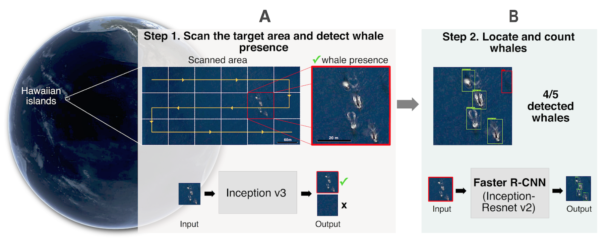
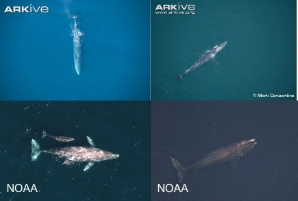

# CNN-Whales-from-Space
Detecting and counting Whales with convolutional neural network from Google Earth imagery

## Getting Started

We address the problem of whale counting in large scale areas represented by a large number of images by combining two models, an image classification model and a whale detection model in images. To build these models, we need to build two training datasets, one for each model.

### Convolutional Neural Networks with Tensorflow API
We used <a href="https://www.tensorflow.org">TensorFlow</a>, an open source library for numerical computation, specializing in machine learning applications.

This codelab was tested on TensorFlow 1.12

```
pip install --upgrade "tensorflow==1.12.*"
```

Step 1. Presence/absence with Tensorflow (https://codelabs.developers.google.com/codelabs/tensorflow-for-poets/#0)
Architecture: Inception v3
Transfer learning: ImageNet
Data-augmentation:flip left right, random crop, random scale, random brightness

```
  parser.add_argument(
      '--flip_left_right',
      default=True,
      help="""\
      Whether to randomly flip half of the training images horizontally.\
      """,
      action='store_true'
  )
  parser.add_argument(
      '--random_crop',
      type=int,
      default=1,
      help="""\
      A percentage determining how much of a margin to randomly crop off the
      training images.\
      """
  )
  parser.add_argument(
      '--random_scale',
      type=int,
      default=1,
      help="""\
      A percentage determining how much to randomly scale up the size of the
      training images by.\
      """
  )
  parser.add_argument(
      '--random_brightness',
      type=int,
      default=1,
      help="""\
      A percentage determining how much to randomly multiply the training image
      input pixels up or down by.\
      """
  )
```
Step 2. Counting with Tensorflow API object-detection (https://github.com/tensorflow/models/tree/master/research/object_detection)
Architecture: Inception-Resnet v2
Transfer learning: Coco

### Training dataset
We built the first large training datasets for whale presence detection, 700 images,  and for whale counting in VHR images, 945 whales from <a href="www.arkive.org">Arkive</a> and <a href="https://www.fisheries.noaa.gov/">NOAA fisheries</a> websites.
Examples:


### Testing dataset

For ships, we selected 400 images from 100 ports around the world. For water and submerged rocks, we selected 400 coastal images randomly around the world, excluding ports and polar regions. For whales, we focused on 10 coastal areas that are known for marine mammal diversity and whale watching (13,348 images in total).

## Authors

Automatic whale counting in satellite images with deep learning
Emilio Guirado, Siham Tabik, Marga L. Rivas, Domingo Alcaraz-Segura, Francisco Herrera
doi: https://doi.org/10.1101/443671

Due to space limitation in Github, the dataset and codes are provided via email request to this email: e.guirado@ual.es and siham@ugr.es

## Acknowledgments

* Arkive photographers, NOAA fisheries photo database
* Tensorflow developers
* Google Earth developer team
